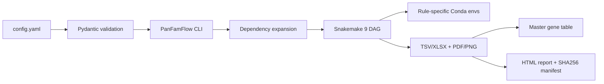

# PanFamFlow

[](CHANGELOG.md)
[](https://snakemake.readthedocs.io/)
[](pyproject.toml)
[](LICENSE)

PanFamFlow 是一个面向植物基因家族、跨基因组泛基因组、复制与选择压力、启动子元件和表达分析的配置驱动工作流。日常运行只需维护一个 `config.yaml`；Python CLI 负责严格校验、模块依赖展开与运行计划，Snakemake 负责 DAG、缓存、失败恢复和集群调度，规则级软件环境由 mamba/conda 隔离，Python 包依赖由 uv 管理。

当前版本为 **v0.1.0 alpha**。核心计算链已经实现并配有单元测试与 toy 配置；尚未在用户的真实多基因组数据上完成端到端生物学验收，因此不能把本仓库中的示例或程序结构视为真实项目结果。

## 设计依据

工作流范围来自两份项目来源文档：

1. 泛基因家族分析模板：BLASTP/HMMER 家族鉴定、IQ-TREE、Core/Soft-core/Shell/Cloud、MCScanX/DupGen_finder、Ka/Ks、2 kb promoter、PlantCARE、fastp/HISAT2/StringTie，以及对应的统计图表。
2. 基因家族—泛基因组—进化与表达综合方案：canonical transcript、OrthoFinder 3 HOG、模块化 QC、跨物种坐标与表达的解释边界、TSV/XLSX 与 PDF/PNG 双格式输出、可追溯主表与运行清单。

实现不是对模板图形的机械复刻。对来源文档中存在方法学风险的部分进行了工程化约束，例如：不把 presence/absence 聚类树称为系统发育树；跨物种物理坐标不直接拼接；跨物种 TPM 不直接比较绝对高低；pairwise `Ka/Ks > 1` 只作为候选信号；OrthoFinder 优先使用 HOG 表而非旧式 Orthogroups 主表。详细映射见 [docs/DESIGN_BASIS.md](docs/DESIGN_BASIS.md)。

## 为什么没有直接 fork 现有流程

评估过的成熟方案包括：

- **Snaketool**：适合作为“Snakemake + CLI”工程模板，本项目采用了其 launcher 思路，但未直接套用旧的 setup.py/cookiecutter 结构。
- **orthosnake**：仅覆盖 Prokka + OrthoFinder，目标偏原核且功能范围不足。
- **smsk_selection**：覆盖 orthology 和正选择，但依赖与项目结构较旧，不能满足 one-config、HOG、植物复制分类、promoter 与表达整合的要求。

因此采用自建的现代 Python 包和 Snakemake 模块，同时复用 OrthoFinder、DupGen_finder、MCScanX、KaKs_Calculator、MEME/FIMO 等经过发表的软件，而不是重写其算法。

## 架构



- `uv`：CLI、配置模型、测试和构建依赖。
- `mamba/conda`：Snakemake engine 与规则级生物信息学软件。
- `Snakemake`：模块依赖、增量运行、重跑、日志和 HPC profile。
- `config.yaml`：物种、输入路径、家族定义、阈值、模块与资源的唯一用户配置入口。

## 快速开始

### 1. 克隆与创建 Snakemake engine

```bash
git clone https://github.com/lianglunping/Wild-rice-Pangenome-Project.git
cd Wild-rice-Pangenome-Project/PanFamFlow

mamba env create -f environment.yaml
```

若环境已经存在：

```bash
mamba env update -n panfamflow-engine -f environment.yaml --prune
```

### 2. 用 uv 安装 Python CLI

```bash
uv sync --all-extras --dev
```

首次联网执行会生成 `uv.lock`。正式分析应将该 lockfile 纳入项目版本控制；仓库 CI 也会验证 lock/sync、测试和构建。

### 3. 初始化分析目录

```bash
uv run panfamflow init my_family_project
cd my_family_project
```

生成：

```text
my_family_project/
├── config.yaml       # 日常分析只修改这一份文件
├── data/
├── references/
├── results/
├── work/
└── logs/
```

### 4. 放置数据并修改 `config.yaml`

每个物种至少需要：

```text
genome.fa
annotation.gff3
```

`protein.fa` 和 `cds.fa` 可选；流程默认从 genome + GFF3 重新生成 canonical protein/CDS，避免版本不一致。

家族定义至少启用一个通道：

```yaml
family:
  name: GPAT
  combine_evidence: intersection
  hmm:
    enabled: true
    hmm: references/PF01553.hmm
  blast:
    enabled: true
    reference_proteins: references/known_GPAT.pep.fa
```

当 HMM 与 BLAST 同时启用且 `combine_evidence: intersection` 时，最终成员需同时获得参考序列相似性和 HMM domain 证据；未通过的候选保存在 `family_candidates_rejected.tsv`，不会被静默丢弃。

### 5. 校验、计划与运行

```bash
uv run panfamflow validate -c config.yaml
uv run panfamflow plan -c config.yaml
uv run panfamflow run -c config.yaml
```

CLI 默认通过以下方式调用 engine，因此无需手工激活 Snakemake 环境：

```text
mamba run -n panfamflow-engine snakemake ...
```

可在 `config.yaml` 中将 `run.engine_env` 设为 `null`，改用当前 `PATH` 中的 `snakemake`。

## 只运行部分分析

有两种等价方式。

### 在 `config.yaml` 固定模块

```yaml
run:
  modules:
    - family
    - phylogeny
    - gene_structure
```

### CLI 临时指定

```bash
uv run panfamflow run -c config.yaml -m family -m phylogeny
```

依赖会自动展开。例如：

```text
phylogeny
└── family
    └── normalize
        └── qc
```

只指定 `qc` 时，不会要求 promoter motif、RNA-seq 或 DupGen_finder outgroup 等无关输入。先用 dry-run 查看 DAG：

```bash
uv run panfamflow run -c config.yaml -m pangenome --dry-run
```

## 模块

| 模块 | 主要任务 | 关键输出 |
|---|---|---|
| `qc` | 输入存在性、大小、SHA256、运行清单 | `00_qc/input_audit.tsv` |
| `normalize` | AGAT longest CDS/canonical transcript；gffread 序列提取 | `01_normalized/normalized.done` |
| `family` | HMMER + BLASTP 候选、证据合并、拒绝审计 | `02_family/family_members.tsv` |
| `phylogeny` | MAFFT + ClipKIT + IQ-TREE ML tree | `03_phylogeny/family.treefile` |
| `gene_structure` | gene/CDS/exon/intron/UTR 指标 | `04_gene_structure/gene_structure_metrics.tsv` |
| `orthology` | OrthoFinder 3 | `05_orthology/orthofinder.done` |
| `pangenome` | HOG membership、泛基因分类、presence/absence、rarefaction | `06_pangenome/pangenome_classification.tsv` |
| `chromosome` | 家族基因坐标、染色体计数与密度 | `07_chromosome/chromosome_distribution.tsv` |
| `duplication` | DupGen_finder-unique 或 MCScanX | `08_duplication/duplication_mode.tsv` |
| `kaks` | MAFFT → PAL2NAL → KaKs_Calculator | `09_kaks/kaks_pairs.tsv` |
| `promoter` | strand-aware promoter 提取 + FIMO | `10_promoter/promoter_elements.tsv` |
| `expression` | fastp + HISAT2 + StringTie TPM，或导入矩阵 | `11_expression/expression_matrix.tsv` |
| `report` | master table、SHA256 manifest、HTML gallery | `report/index.html` |

完整输入、参数、输出和失败场景见 [docs/MODULES.md](docs/MODULES.md)。

## 一份最小 `config.yaml`

```yaml
schema_version: "1.0"

project:
  name: GPAT_pangenome
  root: .
  seed: 20260807
  results_dir: results
  work_dir: work
  logs_dir: logs

run:
  modules: [family, phylogeny, gene_structure]
  cores: 32
  jobs: 32
  engine_env: panfamflow-engine
  use_conda: true
  keep_going: false
  rerun_incomplete: true
  latency_wait: 60
  profile: null
  extra_snakemake_args: []

inputs:
  species:
    - id: Os
      name: Oryza_sativa
      genome: data/Os/genome.fa
      gff3: data/Os/annotation.gff3
      group: Cultivated
      subfamily: Oryza
      representative: true
      outgroup: Og
    - id: Og
      name: Oryza_granulata
      genome: data/Og/genome.fa
      gff3: data/Og/annotation.gff3
      group: Wild
      subfamily: Oryza
      representative: false
      outgroup: null
  rnaseq_samples: []
  expression_matrix: null
  sample_metadata: null

family:
  name: GPAT
  combine_evidence: intersection
  prefix_sequence_ids: true
  hmm:
    enabled: true
    hmm: references/PF01553.hmm
    evalue: 1.0e-5
    domain_evalue: 1.0e-3
    cut_ga: false
  blast:
    enabled: true
    reference_proteins: references/known_GPAT.pep.fa
    evalue: 1.0e-5
    min_identity: 30
    min_query_coverage: 50
    max_target_seqs: 100

promoter:
  upstream_bp: 2000
  downstream_bp: 0
  backend: fimo
  motif_database: references/JASPAR2026_Plantae.meme
  category_map: references/cis_element_categories.tsv
  fimo_threshold: 1.0e-4
  top_n_elements: 20
```

完整模板位于 `src/panfamflow/templates/config.yaml`，字段说明见 [docs/CONFIG.md](docs/CONFIG.md)。

## 软件安装策略

- Python 应用：`uv sync`。
- Snakemake engine：`mamba env create -f environment.yaml`。
- 规则工具：Snakemake `--software-deployment-method conda` 自动创建隔离环境。
- DupGen_finder-unique：官方没有稳定的 Conda 包，本仓库提供非覆盖式安装脚本：

```bash
bash scripts/install_dupgen.sh "$HOME/.local/opt/DupGen_finder"
export PATH="$HOME/.local/opt/DupGen_finder:$PATH"
```

脚本在目标路径已存在时会拒绝覆盖，并提示记录 Git commit。

## HPC / SLURM

本地 profile：

```bash
uv run panfamflow run -c config.yaml --profile /path/to/PanFamFlow/profiles/local
```

SLURM engine：

```bash
mamba env create -f environment-slurm.yaml
```

然后将项目 `config.yaml` 中：

```yaml
run:
  engine_env: panfamflow-engine-slurm
  profile: /path/to/PanFamFlow/profiles/slurm
```

资源模板和后台提交建议见 [docs/HPC.md](docs/HPC.md)。

## 输出与可追溯性

- 结构化结果：TSV + XLSX。
- 正式图：PDF + 600 dpi PNG。
- 输入审计：文件大小与 SHA256。
- 随机过程：`project.seed`，默认 `20260807`。
- 结果索引：`results/report/result_manifest.tsv`。
- 整合主表：`results/12_integrated/master_gene_table.tsv/.xlsx`。
- 临时计算：`work/`，原始输入不覆盖。
- 日志：`logs/<module>/`。

## 关键边界

1. **OrthoFinder HOG node**：有外群时不要长期使用 `hog_node: auto`。检查 `SpeciesTree_rooted_node_labels.txt` 后把目标 clade 的 `N*` 写回配置。
2. **泛基因分类**：默认阈值与来源模板一致，为 `Core >= 0.99`、`Soft-core >= 0.90`、`Shell >= 0.10`、其余 `Cloud`；不是所有研究的普适定律。
3. **缺失不等于丢失**：重点 OGG 的 absence 仍需 TBLASTN/基因预测层面验证。
4. **Ka/Ks**：高 Ks 会标记 `POTENTIAL_SATURATION`；pairwise Ka/Ks 不能替代 codeml branch/site 模型。
5. **promoter**：v0.1 主路线是 JASPAR/MEME motif + FIMO。PlantCARE 的网页式批量提交与结果导入尚未自动化。
6. **expression**：FASTQ 路线生成 StringTie TPM 与模式热图；v0.1 尚未自动执行 DESeq2 contrasts。跨物种结果应以 within-species 标准化、响应方向或 OGG 证据整合为主。
7. **图件范围**：v0.1 先稳定数据层与代表性 QC 图；来源模板中的每一张组合图尚未全部逐图实现。扩展计划见 [docs/ROADMAP.md](docs/ROADMAP.md)。

## 开发与验证

```bash
uv run ruff check .
uv run ruff format --check .
uv run mypy src/panfamflow
uv run pytest -q
uv build
```

Snakemake 静态 dry-run：

```bash
uv run --with 'snakemake>=9,<10' snakemake \
  --snakefile src/panfamflow/workflow/Snakefile \
  --configfile examples/toy/config.yaml \
  --directory examples/toy \
  --cores 2 \
  --dry-run \
  results/00_qc/input_audit.tsv
```

当前本地验证结果记录在 [docs/VALIDATION.md](docs/VALIDATION.md)。

## 引用

使用本软件时，应同时引用启用模块对应的原始软件。软件自身元数据见 [CITATION.cff](CITATION.cff)。

## License

MIT，见 [LICENSE](LICENSE)。第三方生物信息学软件分别遵循其自身许可证。
