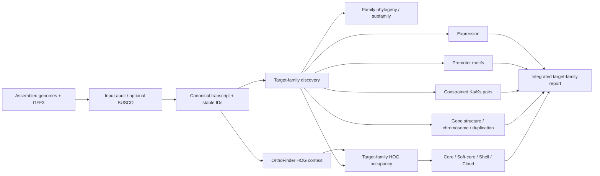

# PanFamFlow — 泛基因家族分析流程

[](CHANGELOG.md)
[](pyproject.toml)
[](environment.yaml)
[](LICENSE)

PanFamFlow 是一个面向**目标基因家族**的配置驱动工作流：在多份已经完成组装和注释的基因组/材料中，完成家族成员鉴定、系统发育、家族 HOG 占有率与 Core/Soft-core/Shell/Cloud 分类、基因结构、染色体分布、复制类型、Ka/Ks、启动子元件、表达模式和整合报告。

日常运行只维护一份 `config.yaml`。Python CLI 负责严格校验、模块选择与依赖展开；Snakemake 负责 DAG、增量运行、失败恢复和集群调度；规则级生物信息学软件由 conda/mamba 隔离；Python 包由 uv 锁定。

当前版本为 **v0.1.1-alpha**。它已经具备软件化目录、单元测试、toy 数据和恢复机制，但尚未在用户的真实大规模水稻泛基因家族数据上完成端到端生物学验收。示例结果只能用于工程验证，不能作为真实研究结论。

## 项目边界：本流程不做什么

PanFamFlow **不是泛基因组组装流程**，也不执行以下任务：

- 不从原始 reads 组装单个基因组；
- 不构建 graph pangenome；
- 不运行 minigraph、PGGB、Cactus 或类似的全基因组图构建；
- 不完成全基因组 SV/PAV calling；
- 不对全基因组全部 HOG 进行泛基因组分类；
- 不把 annotation absence 直接解释为已验证的 gene loss。

PanFamFlow 的输入是**已经组装并注释的 genome FASTA + GFF3**。OrthoFinder 可以在全蛋白组上运行以获得 HOG 背景，但 `pan_family` 下游会严格过滤到 `family_members.tsv` 中的目标家族成员。详见 [docs/SCOPE.md](docs/SCOPE.md)。

## 核心分析单位

| 字段/概念 | 含义 | 不能混同为 |
|---|---|---|
| `stable_id` | `SpeciesID__GeneID`，全流程目标家族基因主键 | transcript isoform |
| `subfamily` | 依据参考基因、家族树和结构域定义的家族亚群 | 自动等同于 HOG |
| `HOG_ID` | 指定 OrthoFinder 物种树节点上的 hierarchical orthogroup | 图基因组位点 |
| `pan_family_class` | 目标家族 HOG 在配置材料中的占有率分类 | 全基因组 pangenome class |
| presence/absence | 注释与 HOG 层面的占有状态 | 已验证的基因获得/丢失 |

## 设计来源

流程根据两份项目来源文档开发：

- `03-泛基因家族分析-模板.pdf`；
- `comparative_genomics_gene_family_workflow_20260807.md`。

来源方案要求 HMMER/BLASTP、IQ-TREE、Core/Soft-core/Shell/Cloud、MCScanX/DupGen_finder、Ka/Ks、2 kb promoter、PlantCARE/FIMO 和 RNA-seq 等分析。PanFamFlow 在此基础上增加 canonical transcript、稳定 ID、拒绝候选审计、HOG 节点固定、输入 SHA256、恢复机制和整合主表。要求与实现的逐项映射见 [docs/DESIGN_BASIS.md](docs/DESIGN_BASIS.md)。

## 核心特性

- **单配置入口**：日常只修改 `config.yaml`。
- **目标家族限定**：`project.analysis_scope` 固定为 `target_pan_gene_family`，`pan_family` 模块不会切换为 whole-genome 模式。
- **任意模块运行**：CLI `-m` 可重复指定，依赖自动展开。
- **智能断点续跑**：跳过完整且仍有效的任务，只重跑失败、不完整、缺失或失效任务。
- **非破坏性**：不覆盖原始 genome/GFF3/FASTQ；中间文件进入 `work/`，结果进入 `results/`。
- **稳定 ID**：统一使用 `SpeciesID__GeneID`。
- **审计缺口可见**：保留拒绝候选、未进入所选 HOG 节点的家族成员和运行 provenance。
- **发表型输出**：结构化结果 TSV + XLSX，图件 PDF + 高分辨率 PNG。
- **本地与 HPC**：提供 local 和 SLURM profile。
- **生物学启动门**：在真实分析前对目标家族冻结、5–10 个 assembled-genome panel、输入 SHA256 和人工正负例执行 fail-closed 审计。

## 总体数据流



## 快速开始

### 1. 克隆当前开发分支

在 PR 合并前，应显式克隆包含 PanFamFlow 的分支：

```bash
git clone --branch feature/panfamflow-v0.1.2-benchmark-gate \
  https://github.com/lianglunping/Wild-rice-Pangenome-Project.git
cd Wild-rice-Pangenome-Project/PanFamFlow
test -f pyproject.toml
test -f src/panfamflow/workflow/Snakefile
```

合并到 `main` 后可改为普通 `git clone`。

### 2. 创建 Snakemake engine

```bash
mamba env create -f environment.yaml
```

已有环境时：

```bash
mamba env update -n panfamflow-engine -f environment.yaml --prune
```

### 3. 安装 Python CLI

```bash
uv sync --locked --dev
```

只有在明确更新 Python 依赖时才执行 `uv lock`，并应审阅 `uv.lock` diff。

### 4. 初始化分析目录

```bash
uv run panfamflow init my_pan_family_project
cd my_pan_family_project
```

生成：

```text
my_pan_family_project/
├── config.yaml
├── .panfamflow/config.schema.json
├── data/
├── references/
├── results/
├── work/
└── logs/
```

### 5. 准备输入

每个材料/物种至少提供：

```text
data/<species>/genome.fa
data/<species>/annotation.gff3
```

`protein.fa` 和 `cds.fa` 可作为来源审计输入；默认流程根据 genome + GFF3 重新生成 canonical protein/CDS，避免注释版本混用。

家族鉴定至少启用一个证据通道：

```yaml
family:
  name: GPAT
  combine_evidence: intersection
  hmm:
    enabled: true
    hmm: references/PF01553.hmm
  blast:
    enabled: true
    reference_proteins: references/known_GPAT.pep.fa
```

### 6. 校验、计划与运行

```bash
uv run panfamflow validate -c config.yaml
uv run panfamflow plan -c config.yaml
uv run panfamflow run -c config.yaml
```

默认 launcher 调用：

```text
mamba run -n panfamflow-engine snakemake ...
```

## 真实水稻生物学 benchmark 启动门

软件 CI 通过只说明代码可执行，不能替代真实目标家族的生物学验收。新项目应先建立独立 benchmark 工作区：

```bash
uv run panfamflow benchmark init benchmarks/rice_pilot
cd benchmarks/rice_pilot
uv run panfamflow benchmark audit \
  --manifest benchmark.yaml \
  --output audits/intake_001 \
  --allow-blocked
```

审计会同时输出：

```text
benchmark_readiness.tsv
benchmark_readiness.xlsx
benchmark_readiness.json
benchmark_readiness.md
benchmark_readiness.html
input_files.tsv
SHA256SUMS.tsv
```

中文 HTML 面向人工审阅，JSON/TSV 面向后续会话和自动化。默认采用 fail-closed 规则：目标家族和验收阈值未冻结、独立 assembled genomes 少于 5 个、四类输入缺失或 SHA256 不匹配、人工正负例不足时，状态保持 `BLOCKED`。同一参考坐标上的多个 BAM/VCF 属于 reference-aligned samples，不能充当多个 assembled genomes。详细口径见 [docs/BIOLOGICAL_BENCHMARK.md](docs/BIOLOGICAL_BENCHMARK.md)。

## 只运行部分分析

配置方式：

```yaml
run:
  modules:
    - family
    - phylogeny
    - pan_family
```

CLI 临时覆盖：

```bash
uv run panfamflow run -c config.yaml \
  -m family \
  -m phylogeny \
  -m pan_family
```

依赖自动展开。例如：

```text
pan_family
├── family
│   └── normalize
│       └── qc
└── orthology
    └── normalize
```

旧预发布名称 `pangenome` 暂时作为 `pan_family` 的兼容别名，但新配置和文档不再使用该名称；`whole_genome` scope 会被配置校验直接拒绝。

## 断点续跑与自动跳过

默认配置：

```yaml
run:
  resume_mode: smart
  keep_going: true
  rerun_incomplete: true
  retries: 1
  rerun_triggers: [mtime, input, params, code, software-env]
```

发生错误后，先修复输入、参数、环境或资源问题，再执行原命令：

```bash
uv run panfamflow run -c config.yaml
```

也可以显式恢复：

```bash
uv run panfamflow status -c config.yaml
uv run panfamflow resume -c config.yaml
```

恢复机制包括 Snakemake job 级跳过、原子输出、IQ-TREE checkpoint、OrthoFinder 签名工作目录和 Ka/Ks pair cache。详细说明与故障注入验收见 [docs/RESUME.md](docs/RESUME.md)。

## 模块与主输出

| 模块 | 范围 | 主输出 |
|---|---|---|
| `qc` | 已组装 genome/GFF3 的输入审计和可选 BUSCO | `00_qc/qc.done` |
| `normalize` | longest-CDS transcript、稳定 ID、canonical 序列 | `01_normalized/normalized.done` |
| `family` | 目标家族 HMMER/BLASTP 鉴定与拒绝审计 | `02_family/family_members.tsv` |
| `phylogeny` | 目标家族 MAFFT/ClipKIT/IQ-TREE | `03_phylogeny/family.treefile` |
| `gene_structure` | 目标家族 gene/CDS/exon/intron/UTR | `04_gene_structure/gene_structure_metrics.tsv` |
| `orthology` | 全蛋白组 HOG 背景，仅供目标家族投影 | `05_orthology/orthofinder.done` |
| `pan_family` | 目标家族 HOG 占有率、四分类、稀释曲线 | `06_pan_family/pan_family_classification.tsv` |
| `chromosome` | 目标家族坐标、计数与密度 | `07_chromosome/chromosome_distribution.tsv` |
| `duplication` | 目标家族 duplication mode | `08_duplication/duplication_mode.tsv` |
| `kaks` | 受约束目标家族 orthology/duplication pairs | `09_kaks/kaks_pairs.tsv` |
| `promoter` | 目标家族启动子与 motif | `10_promoter/promoter_elements.tsv` |
| `expression` | 目标家族表达矩阵/TPM | `11_expression/expression_matrix.tsv` |
| `report` | 目标家族 master table、manifest、HTML | `report/index.html` |

`pan_family` 额外输出：

```text
06_pan_family/
├── pan_family_classification.tsv
├── family_hog_membership.tsv
├── family_presence_absence.tsv
├── unassigned_family_members.tsv
├── pan_family_rarefaction_iterations.tsv
├── pan_family_rarefaction_summary.tsv
└── pan_family_results.xlsx
```

`unassigned_family_members.tsv` 防止所选 HOG node、稳定 ID 或 OrthoFinder 结果不匹配时静默丢失家族成员。

## 输出目录

```text
results/
├── 00_qc/
├── 01_normalized/
├── 02_family/
├── 03_phylogeny/
├── 04_gene_structure/
├── 05_orthology/
├── 06_pan_family/
├── 07_chromosome/
├── 08_duplication/
├── 09_kaks/
├── 10_promoter/
├── 11_expression/
├── 12_integrated/master_gene_table.tsv
└── report/
    ├── index.html
    ├── result_manifest.tsv
    ├── software_versions.tsv
    └── run_info.json
```

字段定义见 [docs/OUTPUT_SCHEMA.md](docs/OUTPUT_SCHEMA.md)。

## 方法学边界

1. `orthofinder.hog_node: auto` 只用于发现；正式结果应固定目标类群的 `N*` 节点。
2. 家族树上的 clade、家族 subfamily、HOG 和 pan-locus 是不同概念，流程不自动互相等同。
3. Core/Soft-core/Shell/Cloud 是目标家族 HOG 的占有率分类，不是全基因组组装结果。
4. 0/1 presence matrix 目前基于 annotation + HOG；缺失不自动等于 gene loss。重点缺失需 TBLASTN/miniprot/共线性和 assembly gap 复核。
5. pairwise `Ka/Ks > 1` 只能作为候选信号，不能替代 codeml/HyPhy 模型。
6. 跨物种物理坐标不直接拼接；按物种分面或共线性投影展示。
7. 跨物种 TPM 不直接用于绝对高低结论；优先比较物种内标准化模式和响应方向。
8. v0.1.1 尚未自动执行 DESeq2 contrasts、codeml、缺失基因 genome rescue 和所有模板组合图。

详细审计见 [docs/AUDIT.md](docs/AUDIT.md)，扩展计划见 [docs/ROADMAP.md](docs/ROADMAP.md)。

## HPC / SLURM

```bash
mamba env create -f environment-slurm.yaml
```

项目配置：

```yaml
run:
  engine_env: panfamflow-engine-slurm
  profile: /absolute/path/to/PanFamFlow/profiles/slurm
```

后台提交与分级退避监控见 [docs/HPC.md](docs/HPC.md)。

## 开发验证

```bash
uv run ruff check .
uv run ruff format --check .
uv run mypy src/panfamflow
uv run pytest -q
uv build
```

Snakemake toy dry-run：

```bash
uv run --with 'snakemake==9.25.1' snakemake \
  --snakefile src/panfamflow/workflow/Snakefile \
  --configfile examples/toy/config.yaml \
  --directory examples/toy \
  --cores 2 \
  --dry-run \
  results/00_qc/qc.done
```

只有 GitHub 分支中 `PanFamFlow/` 目录真实存在，并且当前 head 对应的 CI 全部通过，才可宣称“已发布并验证”。验证记录见 [docs/VALIDATION.md](docs/VALIDATION.md)。

## 引用与许可证

使用本软件时，应同时引用实际启用模块对应的原始软件。软件元数据见 [CITATION.cff](CITATION.cff)。PanFamFlow 采用 MIT License；第三方工具分别遵循其自身许可证。
